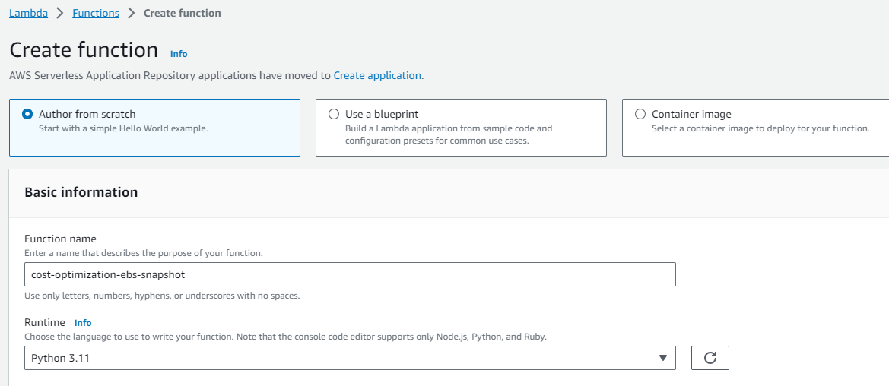
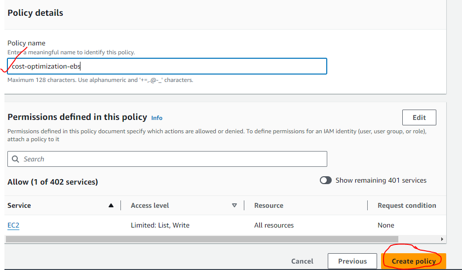

# AWS Cloud Cost Optimization - Identifying Stale Resources

## Identifying Stale EBS Snapshots

    I'll create a Lambda function that identifies EBS snapshots that are no longer associated with any active EC2 instances and delete them to save on storage costs.

### Description:

    The Lambda function fetches all EBS snapshots owned by the same account ('self') and also retrieves a list of active EC2 instances (running and stopped). For each snapshot, it checks if the associated volume (if exists) is not associated with any active instance. If it finds a stale snapshot, it deletes it, effectively optimizing storage costs.

Steps:

1. Go to AWS console and create an instance.

2. Go to EC2 dashboard and find out the 'volume' that has been attached with your EC2 instance.

3. Select 'snapshots' on EC2 dashboard and click on 'create snapshot'. Choose the volume that was created with your EC2 instance.

4. Go to AWS Lambda and create a function.

5. Go to the 'Code Source' at the bottom of the page and paste your code. Press deploy and ctrl+s to save it. Then press 'test'. 

6. Provide a name for the test code and press save.

7. You can go to configuration to edit the 'timeout' parameter.  

8. To edit permissions, go to configuration --> permissions --> role name

9. In IAM go to 'Policies' and choose 'Create policy' --> select a service --> EC2

10. Select the actions you want to perform. In this case, only list (describe) the snapshots and delete the snapshots permissions are needed. Choose "All" resources --> next --> Name the policy (e.g. cost-optimization-ebs)--> Create policy.

11. Created another policy named 'ec2-permissions' to grant 'describe volumes and decsribe instances' and attach that to the snapshot function. Run 'Test' on lambda.

### Our aim is to make sure that if we terminate the instance, the associated EBS volume should also get deleted. Once that happens, the snapshot becomes stale and it should also get deleted (We can set the timeline like if any snapshot is 30 days old it can be deleted).

As soon as we terminate the instance, the volumes gets deleted as well but the snapshot is still there.

On running the 'Test' again in the lambda function, the snapshot got deleted as it wasn't associated with any ebs volume.

